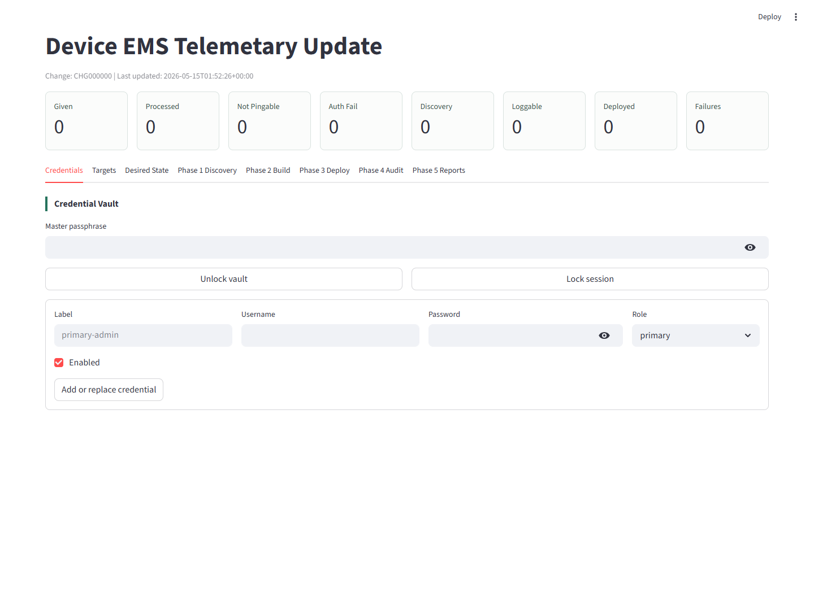
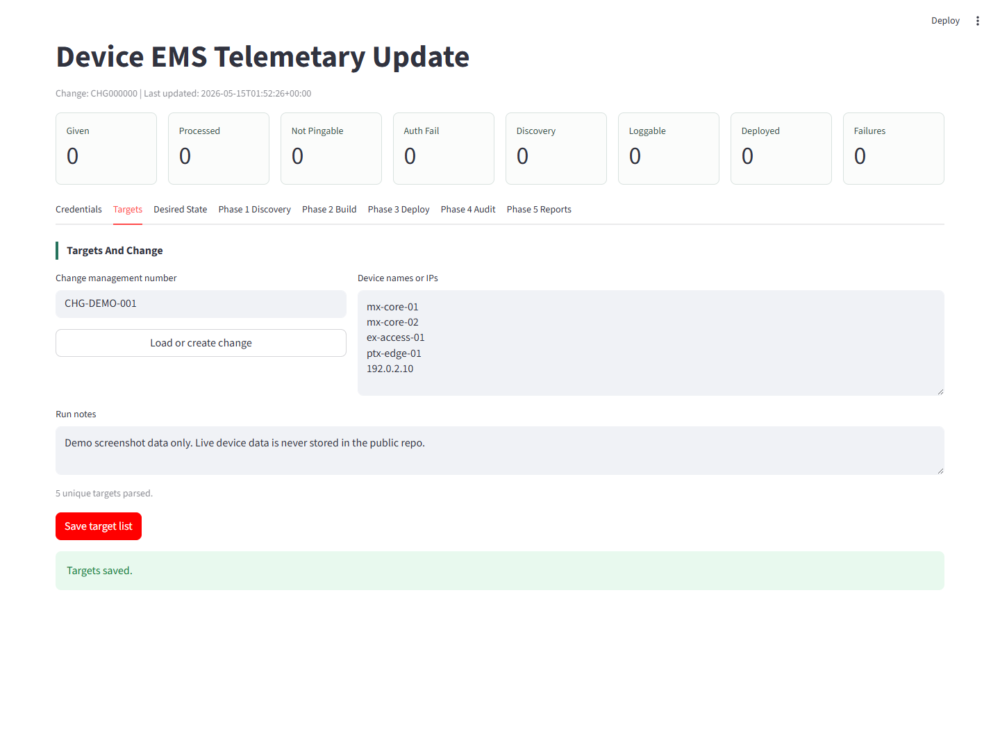
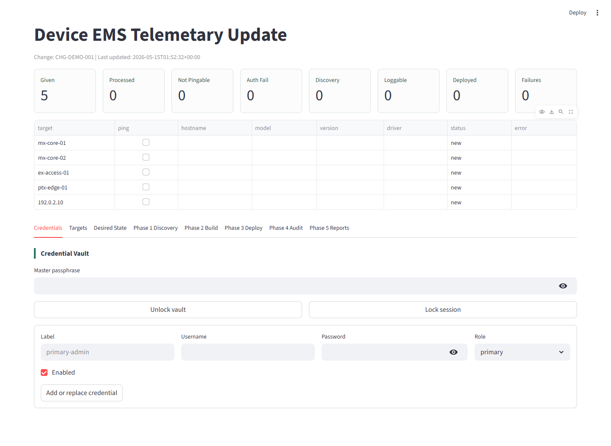
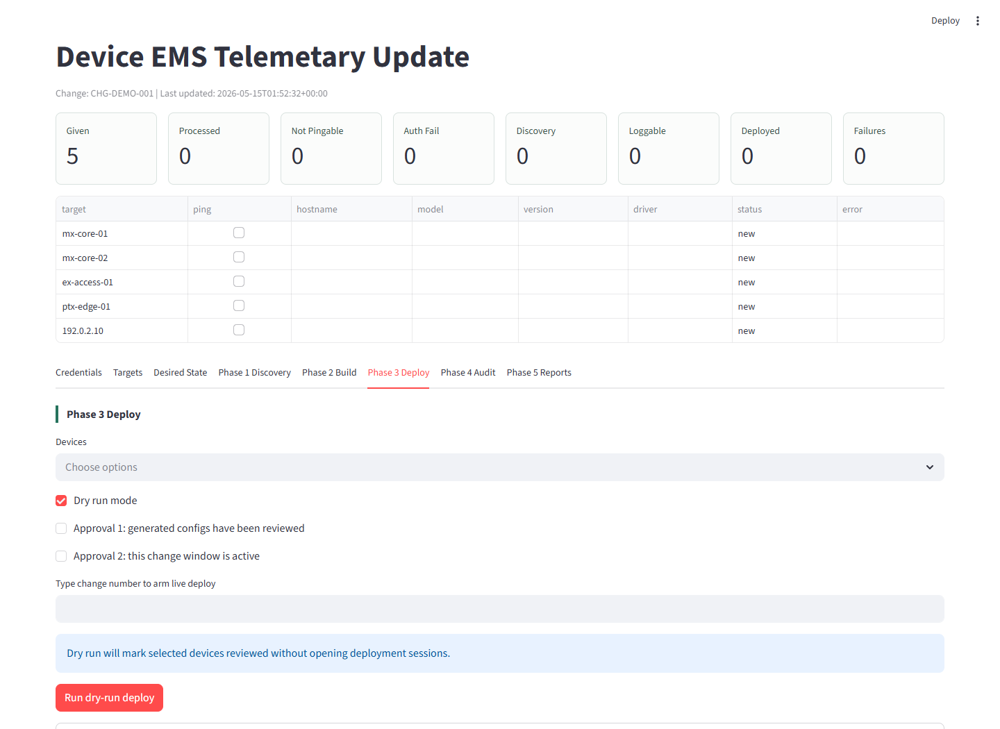

# Device EMS Telemetry Update

Dashboard, headless CLI, and automation framework for Juniper EMS and telemetry changes. The current change templates support validated EX and MX workflows for SNMP communities, TACACS servers, RADIUS cleanup, syslog hosts, NETCONF, LLDP, and NTP servers. PTX devices can be discovered and reported, but config build is intentionally blocked until PTX templates are validated against real configurations.

> Repository note: the GitHub repository and Python package still use `Telemetary` in their names for compatibility with existing clones. The app UI and docs use the correct `Telemetry` spelling.

## Beginner Quick Start

You do not need admin rights for the normal launcher. Each launcher creates a local `.venv` folder inside this project and installs the Python requirements there.

### Linux Server

```bash
git clone https://github.com/titan101/Device_EMS_Telemetary_Update.git
cd Device_EMS_Telemetary_Update
chmod +x run.sh run_server.sh
./run_server.sh
```

Open:

```text
http://SERVER_IP:8502
```

### Laptop Or WSL

```bash
./run.sh
```

Open:

```text
http://127.0.0.1:8502
```

### Windows

```bat
cd Device_EMS_Telemetary_Update
run_dashboard.bat
```

The dashboard starts on `http://localhost:8502`.

## Server Options

Change the listen port without editing code:

```bash
DEVICE_EMS_PORT=8602 ./run_server.sh
```

Manual venv run:

```bash
python3 -m venv .venv
. .venv/bin/activate
python -m pip install -r requirements.txt
streamlit run app.py --server.address 0.0.0.0 --server.port 8502 --server.headless true
```

If Python cannot create `.venv`, ask your server admin for Python venv support. On Ubuntu that package is usually `python3-venv`.

## Headless CLI

Use the CLI for server automation or change workflows that do not need Streamlit. On Linux or WSL, `run_cli.sh` creates the same project-local `.venv` and installs the requirements:

```bash
chmod +x run_cli.sh
./run_cli.sh --help
./run_cli.sh templates
```

A typical change workflow is:

```bash
# Add an encrypted credential profile. Passwords and the vault passphrase are prompted securely.
./run_cli.sh creds-add --label primary --username netops --role primary

# Create the run and inspect or update its desired state.
./run_cli.sh targets CHG12345 --file targets.txt
./run_cli.sh desired-show CHG12345 > desired.json
./run_cli.sh desired-set CHG12345 --file desired.json

# Discover, build, review with a no-connect dry run, and generate reports.
./run_cli.sh discover CHG12345
./run_cli.sh build CHG12345
./run_cli.sh deploy CHG12345
./run_cli.sh report CHG12345

# Live deployment requires both --live and an exact change-ID confirmation.
./run_cli.sh deploy CHG12345 --live --confirm CHG12345
./run_cli.sh audit CHG12345 --confirm-commit
```

Use `--targets device1,device2` with `discover`, `build`, `deploy`, or `audit` to operate on a subset. Commands that unlock the credential vault prompt for its passphrase by default; `--passphrase-env ENV_VAR` is available for controlled non-interactive automation.

On Windows, create the environment and invoke the same module directly:

```powershell
py -3 -m venv .venv
.\.venv\Scripts\python.exe -m pip install -r requirements.txt
.\.venv\Scripts\python.exe -m device_ems_telemetary_update.cli --help
```

## Screenshots









## Workflow

1. Credentials: unlock or create an encrypted local credential vault. Profiles can be `primary`, `secondary`, or `audit`.
2. Targets: enter a change number and paste device names or IPs.
3. Desired State: select the Jinja change templates, then enter TACACS, NTP, syslog, SNMP, NETCONF, LLDP, cleanup options, commit-confirm minutes, audit wait time, and worker count.
4. Phase 1 Discovery: ping first, then log in with the stored credential profiles. PyEZ is tried first; Netmiko is the SSH CLI fallback for devices that do not yet have NETCONF enabled.
5. Phase 2 Build: generate per-device Junos `set` and `delete` configuration from the device model, version, and discovered existing config. A reviewable fix file is written under `data/fix_files/<change>/`.
6. Phase 3 Deploy: dry run is selected by default. Live deploy uses the built per-device fix lines, requires two checkboxes and typing the change number, and uses `commit confirmed <minutes>`.
7. Phase 4 Audit: waits the configured seconds, logs back in, and can confirm the pending commit after a successful audit login.
8. Phase 5 Reports: writes CSV, JSON, and management Markdown files under `data/reports`.
9. Logs: shows run-level and per-device console logs for discovery, build, deploy, and audit.

## Architecture

- `app.py`: Streamlit dashboard and UI styling.
- `device_ems_telemetary_update/models.py`: run, device, credential, and desired-state models.
- `device_ems_telemetary_update/adapters/junos.py`: Junos discovery, deploy, and audit driver.
- `device_ems_telemetary_update/template_engine.py`: model-aware Jinja template catalog and rendering.
- `device_ems_telemetary_update/cli.py`: headless command interface for the full change workflow.
- `templates/junos/change_templates/*.set.j2`: selectable Junos change templates by EMS domain.
- `templates/junos/_archive/*.set.j2`: inactive legacy platform templates kept as migration references.
- `data/runs`: persisted run state per change number.
- `data/reports`: generated reporting artifacts.
- `data/fix_files`: generated per-device fix files.
- `run.sh`: local Linux/WSL launcher using `.venv`.
- `run_server.sh`: Linux server launcher using `.venv` and `0.0.0.0`.
- `run_cli.sh`: Linux/WSL headless CLI launcher using `.venv`.
- `run_dashboard.bat`: Windows launcher using `.venv`.
- `.streamlit/config.toml`: dark operations-console theme.
- `RELEASES.md`: running change notes.

## What Was Updated

- Added selectable Jinja change templates for TACACS/login users, SNMP, NTP, syslog, and NETCONF/LLDP.
- Added per-device-type template matching through template metadata.
- Added a headless CLI for credentials, targets, desired state, discovery, build, deploy, audit, status, and reports.
- Added per-device fix-file generation under `data/fix_files`.
- Added optional SNMP sysDescr discovery fallback for model/version identification.
- Added an explicit unsupported-platform guard so PTX config is not generated before validation.
- Added a Logs tab for run and per-device console output.
- Added explicit legacy login-user cleanup support.
- Added discovery/reporting for existing Junos login users.
- Added Linux/server launchers so a regular user can clone and run the app from a work server.
- Standardized dependency isolation on `.venv`.
- Added a dark Streamlit theme that better matches the other public network tools.
- Corrected visible app/report text to `Telemetry`.
- Added release notes and pytest config.

## Adding A New Jinja Change Template

Create a new file under `templates/junos/change_templates` with a `.set.j2` suffix:

```text
templates/junos/change_templates/my_new_change.set.j2
```

Put metadata comments at the top so the UI can list it:

```jinja
# id: my_new_change
# label: My New Change
# description: What this template changes.
# platforms: ex,mx
# device_types: ex340024p,ex
```

Then add normal Junos `set` or `delete` lines with Jinja variables such as:

```jinja

set system ntp server {{ server }}

```

Restart the app. The new template appears in the **Jinja change templates** selector.

`platforms` matches normalized Junos platform families such as `ex` and `mx`. `device_types` is optional; when present, it limits the template to normalized exact-model or family keys discovered from PyEZ facts, `show version`, or SNMP sysDescr. Examples: `ex340024p`, `ex`, `mx480`, and `mx`. Add `ptx` only after the template has been validated against a real PTX configuration sample.

## BMU/Kiroku Strategy Applied

The BMU/Kiroku pattern that fits this app is: discover device identity, build one job artifact per device, execute batches concurrently, and expose run status/logs to the engineer. This app keeps that strategy local and lightweight:

- Discovery uses PyEZ facts or Netmiko `show version`; optional SNMP sysDescr can identify model/version when CLI discovery is not available.
- Device model/type controls which selected Jinja templates are eligible for each device.
- Phase 2 writes per-device fix files that include deletes and adds for review.
- Phase 3 deploys those generated lines only when live deployment is explicitly armed.
- Discovery, deploy, and audit use worker threads controlled by **Parallel workers**.
- The Logs tab shows the operator what happened per phase and per device.

## Safety Defaults

- Deployment is dry run by default.
- The shipped change templates support EX and MX; PTX build stops with `build_unsupported_platform` pending validation.
- Live deploy is locked unless both approvals are checked and the change number is typed exactly.
- Live Junos deployment uses a commit-confirm timer, defaulting to 30 minutes.
- Audit can confirm the pending commit only after a successful login.
- Credential profiles are encrypted at rest with a local passphrase-derived Fernet key.
- Runtime run-state, report, fix-file, and vault artifacts stay under ignored `data/` paths and are not committed to Git.

## Research Notes

The implementation follows common network automation patterns from Junos PyEZ, Netmiko, and Nornir-style inventory/workflow separation:

- Juniper PyEZ supports candidate configuration load, diff, commit check, and confirmed commits.
- Netmiko provides a practical SSH CLI fallback for Junos devices where NETCONF is not already available.
- Nornir-style separation of inventory, task execution, and vendor adapters is reflected in the workflow and adapter modules without forcing a full Nornir inventory on day one.

## Validation

```bash
. .venv/bin/activate
python -m pytest
python -m compileall app.py device_ems_telemetary_update
```

## Notes For Later Expansion

- Add `adapters/saos.py` for Ciena SAOS once command and commit semantics are defined.
- Add model-specific templates for special EX/VC, MX, and PTX protection-filter cases.
- Add CSV import and export for target lists.
- Add optional `commit check` dry-run mode that opens a candidate session but rolls back before commit.
